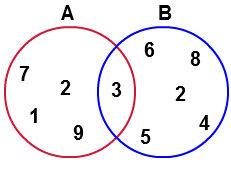
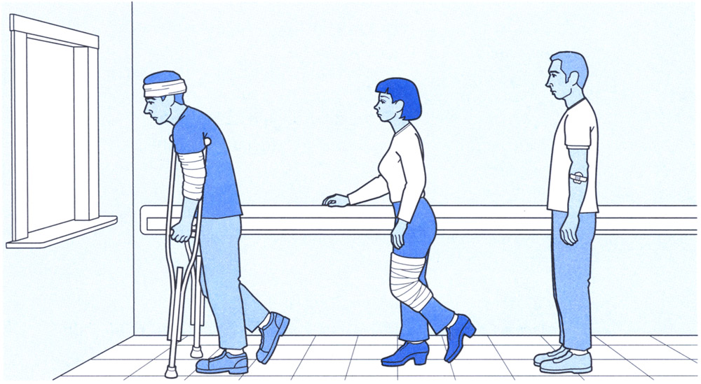
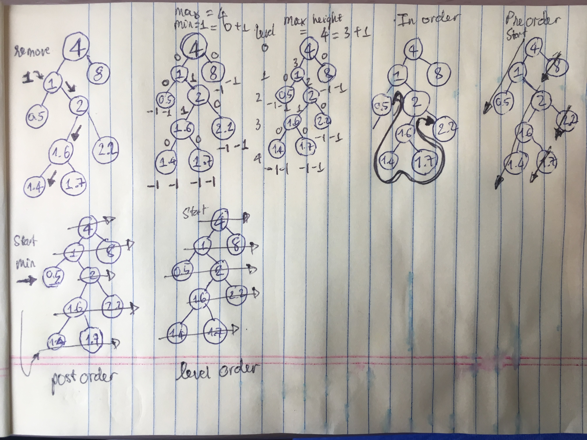

# Popular data structures implemented in Javascript

## Content
* [Stack](#stack)
* [Set](#set)
* [Queue](#queue)
* [Priority queue](#pQueue)
* [Binary search tree](#btree)

### Stack <a name="stack"></a> 

```javascript
    var myStack = new Stack();
    console.log(myStack.length());      // 0
    console.log(myStack.push('a'));     // undefined (push return no value)
    console.log(myStack.push('b'));     // undefined
    console.log(myStack.push('c'));     // undefined
    console.log(myStack.pop());         // c
    console.log(myStack.top());         // b
    console.log(myStack.bottom());      // a
    console.log(myStack.length());      // 2
    
    const Stack = function() {
        let count = 0;
        let content = {};
        this.push = function(value) { // add value on top of the stack
            content[count] = value;
            count++;
        };
        this.pop = function() { // remove value at top of the stack and return that value
            if(count === 0) { return undefined }
            count--;
            var popped = content[count];
            delete content[count];
            return popped;
        };
        this.length = function() { return count } // return number of values in stack
        this.top = function() {  // return the value on top of the stack
            if(count === 0 ) { return undefined }
            return content[count-1]
        }
        this.bottom = function() { // return the value at the bottom of the stack
            if(count === 0 ) { return undefined }
            return content['0']
        }
    }
```
* Javascript array object has all Stack data structure attributes and methods. However, we can always implement a stack data structure by ourself and add more property/method as we want.


### Set <a name="set"></a>

```javascript
    const mySet = new Set();
    console.log(mySet.add('a'));                    // a is added to set!
    console.log(mySet.exist('a'));                  // true
    console.log(mySet.exist('b'));                  // false
    console.log(mySet.list());                      // [ 'a' ]
    console.log(mySet.add('b'));                    // b is added to set!
    console.log(mySet.add('c'));                    // c is added to set!
    console.log(mySet.remove('c'));                 // c is removed from set!
    console.log(mySet.list());                      // [ 'a', 'b' ]
    console.log(mySet.length());                    // 2
    const mySet2 = new Set();
    console.log(mySet2.add('a'));                   // a is added to set!
    console.log(mySet2.add('g'));                   // g is added to set!
    console.log(mySet2.add('h'));                   // h is added to set!
    console.log(mySet2.list());                     // [ 'a', 'g', 'h' ]
    console.log(mySet.union(mySet2).list());        // [ 'a', 'b', 'g', 'h' ]
    console.log(mySet.intersect(mySet2).list());    // [ 'a' ]
    console.log(mySet.difference(mySet2).list());   // [ 'b', 'g', 'h' ]
    
    const Set = function() {
        let set = [];
        this.exist = function(element) { // check if element is in set return true, else return false
            return (set.indexOf(element) !== -1)
        }
        this.add = function(element) { // add element to set if not exist, do not add if it exists
            if(!this.exist(element)) {
                set.push(element);
                return `${element} is added to set!`;
            }
        }
        this.list = function() { // list all element in set
            return set;
        }
        this.remove = function(element) { // remove an element if it's in set
            if(this.exist(element)) {
                set.splice(set.indexOf(element), 1);
                return `${element} is removed from set!`;
            } else { return `${element} is not in set!`; }
        }
        this.length = function() { // return number of element in set
            return set.length;
        }
        this.union = function(setC) { // return the union set of two sets
            let union = new Set();
            let setA = this.list();
            let setB = setC.list();
            for(let i = 0; i < setA.length; i++) {
                union.add(setA[i]);
            }
            for(let j = 0; j < setB.length; j++) {
                union.add(setB[j]);
            }
            return union;
        }
        this.intersect = function(setC) { // return a set of intersection of 2 sets
            let intersect = new Set();
            let setA = this;
            let setB = setC.list();
            for(let i = 0; i < setB.length; i++) {
                if(setA.exist(setB[i])) {
                    intersect.add(setB[i])
                }
            }
            return intersect;
        }
        this.difference = function(setC) { // return a set of difference of 2 sets
            let setA = this;
            let difference = setA.union(setC);
            let setB = setA.intersect(setC).list();
            for(let i = 0; i < setB.length; i++) {
                difference.remove(setB[i]);
            }
            return difference;
        }
    }
```


### Queue <a name="queue"></a> 

```javascript
    const myQueue = new Queue();
    myQueue.enqueue('a');            
    myQueue.enqueue('b');           
    myQueue.enqueue('c');           
    myQueue.list();                 // [ 'a', 'b', 'c' ]
    console.log(myQueue.dequeue()); // a
    console.log(myQueue.front());   // b
    console.log(myQueue.length());  // 2
    console.log(myQueue.isEmpty()); // false
    myQueue.list();                 // [ 'b', 'c' ]
    
    function Queue() { // first in, first out (FIFO)
        const content = [];
        this.list = function() { console.log(content) }; // list all queue item
        this.enqueue = function(element) { content.push(element) }; // put item to the queue
        this.dequeue = function() { return content.shift() }; // get the first item in the queue, remove it from the queue
        this.front = function() { return content[0] }; // get the first item in the queue, still let it be in the queue
        this.length = function() { return content.length }; // get queue length
        this.isEmpty = function() { return (content.length == 0) } // check if queue is empty
    }
```


### Priority Queue <a name="pQueue"></a> 

```javascript
    const myQueue = new priorityQueue();
    myQueue.enqueue(['a', 2]);      
    myQueue.enqueue(['b', 3]);          
    myQueue.list();             // [ [ 'a', 2 ], [ 'b', 3 ] ]
    myQueue.enqueue(['c', 4]);           
    myQueue.list();             // [ [ 'a', 2 ], [ 'b', 3 ], [ 'c', 4 ] ]       
    myQueue.enqueue(['d', 3]);    
    myQueue.list();             // [ [ 'a', 2 ], [ 'b', 3 ], [ 'd', 3 ], [ 'c', 4 ] ]      
    myQueue.enqueue(['e', 1]);    
    myQueue.list();             // [ [ 'e', 1 ], [ 'a', 2 ], [ 'b', 3 ], [ 'd', 3 ], [ 'c', 4 ] ]    
    console.log(myQueue.dequeue()); // [ 'e', 1 ]
    console.log(myQueue.front());   // [ 'a', 2 ]
    console.log(myQueue.length());  // 4
    console.log(myQueue.isEmpty()); // false
    
    function priorityQueue() { // Queue where item with highest priority get out first no matter when added
        const content = [];
        this.list = function() { console.log(content) }; // list all queue item
        this.dequeue = function() { return content.shift() }; // get the first item in the queue, remove it from the queue
        this.front = function() { return content[0] }; // get the first item in the queue, still let it be in the queue
        this.length = function() { return content.length }; // get queue length
        this.isEmpty = function() { return (content.length == 0) } // check if queue is empty
        this.enqueue = function(element) { // put item to the queue with priority
            if(this.isEmpty()) { return content.push(element) };
            var added = false;
            for(let i = 0; i < content.length; i ++) { // 1 is highest priority
                if(element[1] < content[i][1]) {
                    content.splice(i, 0, element);
                    added = true;
                    break;
                }
            }
            if(!added) { content.push(element) }
        };
    }
```


### Binary search tree <a name="btree"></a>

* Search item in tree `fast` __O(log n)__, find `min` and `max`, `inOrder`, `preOrder`, `postOrder`, `levelOrder`
* `preOrder` used when need to explore the __roots__ before inspecting any leaves
* `postOrder` used when need to explore all the __leaves__ before any nodes
* `inOrder` used when need to __flatten__ the tree back into its sequence (bottom up)
* `levelOrder` used when need to inspect __nodes at height level__
```javascript
    const util = require('util')

    class Node {
        constructor(data, left = null, right = null) {
            this.data = data;
            this.left = left;
            this.right = right;
        } 
    }

    class binarySearchTree {
        constructor() { this.root = null }
        add(data) { // add node to binary tree
            const node = this.root;
            if(this.root === null) { this.root = new Node(data) } else {
                searchLeaf(node);
                function searchLeaf(node) {
                    if(data < node.data) {
                        if(node.left === null) { return node.left = new Node(data) }
                        searchLeaf(node.left);
                    } else if(data > node.data) {
                        if(node.right === null) { node.right = new Node(data) }
                        searchLeaf(node.right);
                    } else { return null }
                }
            }
        }
        findMin() { // find min value in binary tree
            let current = this.root;
            while(current.left !== null) { current = current.left }
            return current.data;
        }
        findMax() { // find max value in binary tree
            let current = this.root;
            while(current.right !== null) { current = current.right }
            return current.data;
        }
        exist(data) { // check if a data is in binary tree
            let current = this.root;
            while(current) { 
                if(current.data === data) { return true }
                else if(current.data > data) { current = current.left }
                else { current = current.right }
            }
            return false
        }
        remove(data) { // remove a node from binary tree
            this.root = removeNode(this.root, data);
            function removeNode(node, data) {
                if(node == null) {  return null } // root node/tree has nothing in it
                if(data < node.data) { // not match, move to left
                    node.left = removeNode(node.left, data);
                } else if(data > node.data) { // not match, move to right
                    node.right = removeNode(node.right, data);
                } else { // found matching node
                    if(node.left === null && node.right === null) { return null } // no children
                    if(node.left === null) { return node.right } // has right child
                    if(node.right === null) { return node.left } // has left child
                    let rightThenFarthestLeft = node.right; // has both left, right child
                    while(rightThenFarthestLeft.left !== null) {
                        rightThenFarthestLeft = rightThenFarthestLeft.left;
                    }
                    node.data = rightThenFarthestLeft.data;
                    removeNode(node.right, rightThenFarthestLeft.data);
                }
                return node;
            }
        }
        findMinHeight(node = this.root) { // get min height of tree
            if (node == null) { return -1 }
            let left = this.findMinHeight(node.left);
            let right = this.findMinHeight(node.right);
            if (left < right) { return left + 1 } 
            else { return right + 1 }
        }
        findMaxHeight(node = this.root) { // get max height of tree
            if (node == null) { return -1 }
            let left = this.findMaxHeight(node.left);
            let right = this.findMaxHeight(node.right);
            if (left < right) { return right + 1 } 
            else { return left + 1 }
        }
        isBalanced() { // check if tree is balanced
            return (this.findMinHeight() >= this.findMaxHeight() - 1)
        }
        inOrder() { // traverse tree to array min -> max
            if (this.root == null) { return null } else {
                var result = new Array();
                traverseInOrder(this.root);
                return result;
                function traverseInOrder(node) {       
                    node.left && traverseInOrder(node.left);
                    result.push(node.data);
                    node.right && traverseInOrder(node.right);
                }
            };
        }
        bottomUp() { return this.inOrder() } // synonym of inOrder 
        topDown() { // traverse tree to array max -> min
            if (this.root == null) {
                return null;
            } else {
                var result = new Array();
                traverseInOrder(this.root);
                return result;
                function traverseInOrder(node) {       
                    node.right && traverseInOrder(node.right);
                    result.push(node.data);
                    node.left && traverseInOrder(node.left);
                }
            };
        }
        preOrder() {
            if (this.root == null) { return null } else {
                var result = new Array();
                function traversePreOrder(node) {
                    result.push(node.data);
                    node.left && traversePreOrder(node.left);
                    node.right && traversePreOrder(node.right);
                };
                traversePreOrder(this.root);
                return result;
            };
        }
        postOrder() {
            if (this.root == null) { return null } else {
                var result = new Array();
                function traversePostOrder(node) {
                    node.left && traversePostOrder(node.left);
                    node.right && traversePostOrder(node.right);
                    result.push(node.data);
                };
                traversePostOrder(this.root);
                return result;
            }
        }
        levelOrder() {
            let result = [];
            let Q = []; 
            if (this.root != null) {
                Q.push(this.root);
                while(Q.length > 0) {
                    let node = Q.shift();
                    result.push(node.data);
                    if (node.left != null) {
                        Q.push(node.left);
                    };
                    if (node.right != null) {
                        Q.push(node.right);
                    };
                };
                return result;
            } else {
                return null;
            };
        };
    }


    var myBt = new binarySearchTree();
    myBt.add(4);
    myBt.add(1);
    myBt.add(8);
    myBt.add(0.5);
    myBt.add(2);
    myBt.add(1.6);
    myBt.add(2.2);
    myBt.add(1.4);
    myBt.add(1.7); 
    console.log(util.inspect(myBt, {showHidden: false, depth: null}));
    //    {
    //        root    : {
    //            data    : 4,
    //            left    : {
    //                data    : 1,
    //                left    : { 
    //                    data: 0.5, 
    //                    left: null, 
    //                    right: null 
    //                },
    //                right   : {
    //                    data    : 2,
    //                    left    : {
    //                        data    : 1.6,
    //                        left    : { 
    //                            data    : 1.4, 
    //                            left    : null, 
    //                            right   : null 
    //                        },
    //                        right   : { 
    //                            data    : 1.7, 
    //                            left    : null, 
    //                            right   : null 
    //                        } 
    //                    },
    //                    right: { 
    //                        data: 2.2, 
    //                        left: null, 
    //                        right: null 
    //                    } 
    //                } 
    //            },
    //            right   : { 
    //                data: 8, 
    //                left: null, 
    //                right: null 
    //            } 
    //        } 
    //    }
    console.log(myBt.findMin());        // 0.5
    console.log(myBt.findMax());        // 8
    console.log(myBt.exist(5));         // false
    console.log(myBt.exist(2.2));       // true
    console.log(myBt.findMinHeight());  // 1
    console.log(myBt.findMaxHeight());  // 4 
    console.log(myBt.inOrder());        // [ 0.5, 1, 1.4, 1.6, 1.7, 2, 2.2, 4, 8 ]
    console.log(myBt.bottomUp());       // [ 0.5, 1, 1.4, 1.6, 1.7, 2, 2.2, 4, 8 ] 
    console.log(myBt.isBalanced());     // false
    console.log(myBt.topDown());        // [ 8, 4, 2.2, 2, 1.7, 1.6, 1.4, 1, 0.5 ]
    console.log(myBt.preOrder());       // [ 4, 1, 0.5, 2, 1.6, 1.4, 1.7, 2.2, 8 ]
    console.log(myBt.postOrder());      // [ 0.5, 1.4, 1.7, 1.6, 2.2, 2, 1, 8, 4 ]
    console.log(myBt.levelOrder());     // [ 4, 1, 8, 0.5, 2, 1.6, 2.2, 1.4, 1.7 ]
    console.log(myBt.remove(1));
    console.log(util.inspect(myBt, {showHidden: false, depth: null}));
    //    {
    //        root    : {
    //            data    : 4,
    //            left    : {
    //                data    : 1.4,
    //                left    : { 
    //                    data    : 0.5, 
    //                    left    : null, 
    //                    right   : null 
    //                },
    //                right   : { 
    //                    data    : 2, 
    //                    left    : {
    //                        data    : 1.6,
    //                        left    : null,
    //                        right   : { 
    //                            data    : 1.7, 
    //                            left    : null, 
    //                            right   : null 
    //                        }
    //                    },
    //                    right   : { 
    //                        data    : 2.2, 
    //                        left    : null, 
    //                        right   : null 
    //                    } 
    //                } 
    //            },
    //            right   : { 
    //                data    : 8, 
    //                left    : null, 
    //                right   : null 
    //            } 
    //        } 
    //    }
```